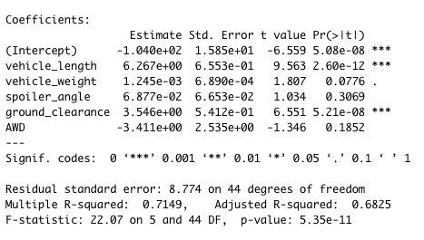
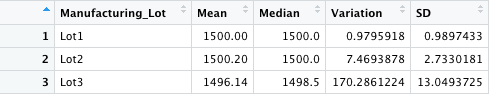
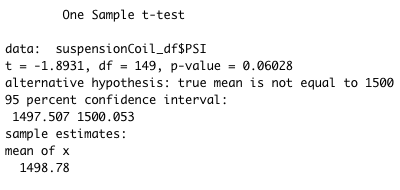
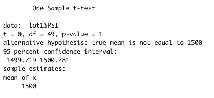
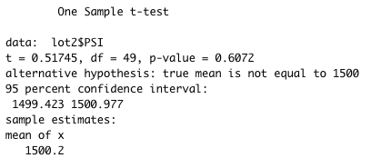
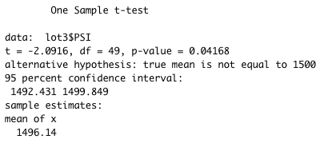

# MechaCar_Statistical_Analysis

## Overview
### Purpose
AutosRUs’ newest prototype, the MechaCar, is suffering from production troubles that are blocking the manufacturing team’s progress. Upper management has requested a review of the production data for insights that may help the manufacturing team.

A multiple linear regression model was utilized to determine which factors affect fuel efficiency (MPG) the most. After running the regression, the production team will be able to predict MPG levels based off of varying levels of automotive metrics. 

In this dataset, the weight capacities of multiple suspension coils were tested to determine if the manufacturing process is consistent across production lots. To identify possible inconsistencies with suspension coils, t-tests were computed to determine if the mean PSI of the prototype is equal to the PSI of the population mean. 

## Analysis
### Linear Regression to Predict MPG
I performed multiple linear regression analysis using vehicle length, vehicle weight, spoiler angle, ground clearance, and AWD as the right hand side variables to determine if it had any effect on the outcome variable, mpg. My analysis will help to identify which variables, if any, in the dataset predict the mpg of MechaCar prototypes. The null hypothesis, in this case, is simply the slope of the linear model is zero or there is no correlation. The alternative hypothesis is that the slope is non-zero, and there is evidence that the correlation between Y and the X variables are not 0. 

  

The y-intercept value is not realistic and insignificant as it is impossible to have negative mpg, so it should not be used to interpret the value of Y when the right hand side variables are held constant at 0. The coefficicents of the right hand side variables calculate the rate of change on mpg (Y) with a 1 unit increase in the respective x variable. For example, a one unit increase in vehicle length would result in a 6.27% increase in mpg.

The figures to pay attention to are the p-values of the independent varaibles denoted as "Pr(>|t|)" in the summary table. The p-values represent the probability that each coefficient contributes a random amount of variability to the linear model. Variables with low p-values have a significant impact on mpg and are statistically unlikely to provide random amounts of variance to the linear model. Therefore, vehicle weights and ground clearance are the only variables that are statistically signficant at the 95% threshold. Vehicle length is the most predictive right-hand-side variable in this model according to the p-value. The lack of significant variables is evidence of overfitting, which indicates that the performance of a model performs well with a current dataset, but may fail to generalize and predict future data correctly.

Another sigificant figure is the R-squared value. This tells us how much of the variability around mpg that can be explained. We know that 71.49% of the variability of mpg can be explained. The closer this number is to 1, the better the model is.

The multiple linear regression model generated a p-value significantly less than the significance level at 95%. This tells us that this model is statistically significant and that we can reject the nulll hypothesis that there is no correlation between mpg and the right-hand-side variables.

### Summary Statistics on Suspension Coils
I was tasked with collecting summary statistics on the pounds per square inch (PSI) of the suspension coils from the manufacturing lots. In this dataset, the weight capacities of multiple suspension coils were tested to determine if the manufacturing process is consistent across production lots.

The design specifications for the MechaCar suspension coils dictate that the variance of the suspension coils must not exceed 100 pounds per square inch. 

#### Total

Above are the summary statistics on the pounds per square inch (PSI) of the suspension coils from all three manufacturing lots. The mean is less than the median, which indicates a negatively skewed distribution. Variation does not exceed 100 pounds per square inch, so it appears that, in total, the current manufacturing data meets this design specification.

#### Per Lot

After grouping by each lot and calculating the summary statistics it is apparent that lot 3 does not meet the design specifications as its variation exceeds 100 PSI. Lot 3 must be investigated further to identify the issue.

### T-Tests on Suspension Coils
After computing the summary statistics in the last section, I will run t-tests to determine if each manufacturing lot's mean is statistically different from the population mean. 

H0: each lot's mean is equal to the population mean
Ha: each lot's mean is not equal to the population mean 

significance level: 95%, alpha = .05,
population mean = 1,500 PSI

#### Lot 2
  
The p-value generated from the t-test of the mean PSI of all lots was .06028. Because the p-value is greater than alpha, we fail to reject the null hypothesis that the mean is equal to the population. This result suggests that there is not a significant statistical difference in PSI from the mean PSI and the population mean.

#### Lot 1
  
The p-value generated from the t-test was 1 indicating that the sample mean of lot 1 and the population mean are equal. Because the p-value is greater than alpha, we fail to reject the null hypothesis that the lot's mean is equal to the population. This result suggests that there is not a significant statistical difference in PSI from the mean PSI of lot 1 and the population mean.
#### Lot 2
  
The p-value generated from the t-test was .6072. Because the p-value is greater than alpha, we fail to reject the null hypothesis that the lot's mean is equal to the population. This result suggests that there is not a significant statistical difference in PSI from the mean PSI of lot 2 and the population mean.
#### Lot 3
  
The p-value generated from the t-test was .04168. Because the p-value is less than alpha, we reject the null hypothesis that the lot's mean is equal to the population. This result suggests that there is a difference in PSI from the mean PSI of lot 3 and the population mean.

### Study Design: MechaCar vs Competition

In order to build consumer interest in the MechaCar, it is necessary to differentiate the MechaCar's metrics against other competition. When shopping for a new car, consumers look at metrics like cost, safety rating, and fuel efficiency. Because of rising gas prices, city fuel efficiency (MPG) will be highly sought after and will be the subject of this study.

#### Study Design

In order to compare the city MPG of the MechaCar to a competitor's city MPG, a paired t-test of both car's means must be computed. The null and alternative hypotheses are the following:

Null Hypothesis: The mean of MechaCar city MPG is the same as the mean of the competitor's city MPG
Alternative Hypothesis: MechaCar city MPG mean is greater than the mean of the competitor's city MPG

Running a t-test would give distinguish possible differences in means of both cars. In this case, the hope is that the null hypothesis would be rejected, which suggests that there is evidence that there is a difference in means. This is a one-tailed t-test, so we are looking for the possibility of a relationship in just one direction of the distribution. I am testing whether the mean MPG of the MechaCar is significantly greater than the mean MPG of the competitor. The mean is significantly greater than the competitor's mean if the test statistic is in the top 5% of its probability distribution, resulting in a p-value less than alpha.

To run this study, a sufficient amount of data of each car's city MPG would be need to be collected. According to the Central Limit Theorem, a sample size larger than 30 is sufficient for the theorem to hold.